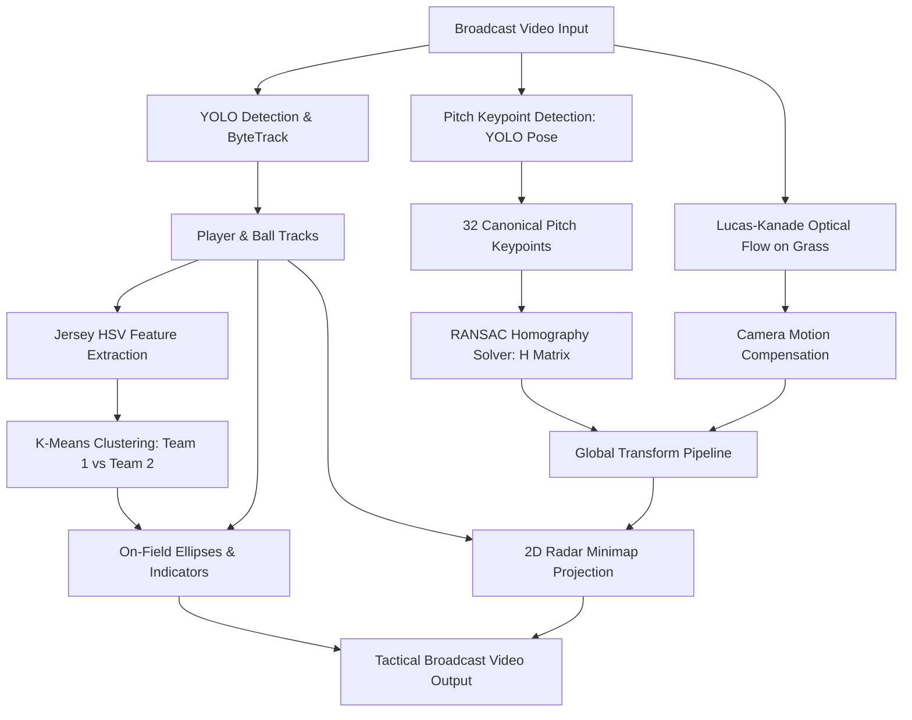

# Football Analytics & Tactical Minimap Generator

[](https://www.python.org/)
[](https://pytorch.org/)
[](https://ultralytics.com/)
[](https://opencv.org/)
[](tests/)

An end-to-end computer vision and deep learning pipeline that transforms single-view football broadcast footage into tactical telemetry and a dynamic 2D bird's-eye minimap. The system detects and tracks players, goalkeepers, referees, and the ball, clusters team jerseys using unsupervised HSV feature extraction, and projects player trajectories onto a canonical football pitch model via keypoint homography and sparse optical flow compensation.

---

## Architecture & Pipeline



---

## Key Features

- **Multi-Class Detection & Persistent Tracking**: Custom-trained YOLOv8 detector combined with **ByteTrack** to maintain stable identities across long occlusions and dense player interactions.
- **Unsupervised Dynamic Team Assignment**:
  - Crops player jersey regions and extracts illumination-filtered HSV color distributions ($40 < V < 220$).
  - Performs **K-Means clustering** ($k=2$) to dynamically assign players to their respective teams.
  - Converts cluster centroids back to BGR to automatically render team rings matching their real jersey kits.
  - Includes an exponential moving average (EMA) memory buffer and periodic re-verification to prevent jersey flicker.
- **Planar Homography & Pitch Mapping**:
  - Detects 32 canonical field keypoints (corners, 18-yard boxes, penalty arcs, center circle).
  - Estimates the projective transformation matrix $H$ mapping image pixels $(u, v)$ to top-down metric coordinates $(X, Y)$ on a standard $1050 \times 680$ pitch canvas using RANSAC.
- **Keyframe Interpolation & Flow Stabilization**:
  - Precomputes high-confidence homography keyframes across regular intervals.
  - Compensates for smooth broadcast camera pan, tilt, and zoom between keyframes using sparse **Lucas-Kanade optical flow** tracked on grass features.
- **Broadcast-Grade Visual Engine**:
  - Team-colored base ellipses with identity tags for outfield players.
  - Directional triangle indicator tracking ball possession.
  - Picture-in-picture 2D tactical pitch minimap rendered in real time.

---

## Repository Structure

```text
football-nn-main/
├── cli/                      # Command-line execution handlers
│   ├── __init__.py
│   ├── analyze.py            # Video inference & minimap pipeline
│   └── train.py              # YOLO training orchestration
├── assigner/                 # Team assignment & jersey clustering
│   ├── __init__.py
│   └── assigner.py           # HSV feature extraction & KMeans engine
├── homography/               # Homography & camera motion
│   ├── __init__.py
│   └── homography.py         # 32-point canonical model, RANSAC, LK flow
├── tracking/                 # Deep learning detectors & trackers
│   ├── __init__.py
│   ├── pitch_tracking.py     # YOLO pose keypoint detector
│   └── tracker.py            # YOLO detection + Supervision ByteTrack
├── renderer/                 # Visual overlays & canvas rendering
│   ├── __init__.py
│   └── renderer.py           # Minimap pitch canvas & player indicators
├── utils/                    # Video I/O & helper routines
│   ├── __init__.py
│   └── video_utils.py        # Frame reading & VideoWriter utilities
├── tests/                    # Comprehensive unit test suite (32 tests)
│   ├── test_assigner.py      # Tests for KMeans & color assignment
│   ├── test_geometry.py      # Bounding box & coordinate transformations
│   └── test_homography.py    # Homography estimation & interpolation
├── models/                   # Model weight checkpoints
│   ├── player_best.pt        # Trained player/ball/referee YOLO weights
│   └── field_best.pt         # Trained pitch keypoint pose weights
├── config.py                 # Central system configuration
├── main.py                   # Unified CLI entry point
├── requirements.txt          # Python dependencies
└── README.md
```

---

## Installation & Setup

### 1. Clone Repository
```bash
git clone https://github.com/your-username/football-analytics.git
cd football-analytics
```

### 2. Create Virtual Environment

**On Linux / macOS:**
```bash
python3 -m venv .venv
source .venv/bin/activate
```

**On Windows (PowerShell):**
```powershell
python -m venv .venv
.venv\Scripts\Activate.ps1
```

### 3. Install Dependencies
```bash
pip install --upgrade pip
pip install -r requirements.txt
```

> **Note on GPU Acceleration:** PyTorch will automatically use CUDA if an NVIDIA GPU is detected, MPS if running on Apple Silicon, or fall back to CPU.

---

## Usage & CLI Reference

All workflows are controlled through `main.py`.

### 1. Analyze a Football Match Video
Run the complete tracking, team clustering, and minimap rendering pipeline:
```bash
python main.py analyze --input input_video.mp4 --output output_video.avi
```

#### Available Flags for `analyze`:
| Flag | Short | Default | Description |
| :--- | :--- | :--- | :--- |
| `--input` | `-i` | `config.input_video_path` | Path to the source football broadcast video |
| `--output` | `-o` | `config.output_video_path` | Output destination file (`.avi` or `.mp4`) |
| `--player-model` | | `models/player_best.pt` | Path to player/ball YOLO model checkpoint |
| `--field-model` | | `models/field_best.pt` | Path to field keypoint YOLO pose checkpoint |
| `--device` | | Auto-detected | Device to run inference on (`cuda`, `mps`, `cpu`) |

### 2. Train Object Detection Models
Fine-tune a YOLOv8 detector on custom football datasets:
```bash
python main.py train --data ./data/football-players-detection --epochs 50 --batch-size 8
```

#### Available Flags for `train`:
| Flag | Short | Default | Description |
| :--- | :--- | :--- | :--- |
| `--data` | `-d` | `config.Train.train_data_path` | Path to dataset `data.yaml` |
| `--epochs` | `-e` | `50` | Number of training epochs |
| `--batch-size` | | `8` | Training batch size |
| `--output` | `-o` | `models/best.pt` | Path to save the best model checkpoint |
| `--confidence` | `-c` | `0.1` | Confidence threshold |
| `--device` | | Auto-detected | Acceleration device |
| `--resume` | | `False` | Resume training from last checkpoint |

---

## Running Tests

The test suite validates the mathematical foundations, homography interpolation, coordinate geometry, and team clustering logic without requiring GPU or dataset dependencies.

Run all 32 unit tests using `pytest`:
```bash
pytest tests/
```

Expected output:
```text
tests/test_assigner.py ..............   [ 43%]
tests/test_geometry.py ...........      [ 78%]
tests/test_homography.py .......        [100%]

======================== 32 passed in ~1.5s ========================
```

---

## Configuration (`config.py`)

Global hyperparameters and default paths can be adjusted directly in [`config.py`](config.py):
- **Hardware Acceleration**: Automatic CUDA / MPS / CPU detection.
- **Default Paths**: Configurable input/output video paths and model weights.
- **Fallback Colors**: Custom RGB values for referees and unassigned objects.
- **Training Parameters**: Image resolution (`imgsz=640`), batch size, base YOLO architecture.

---

## Pretrained Model Weights

The repository includes ready-to-use pretrained checkpoints inside the [`models/`](models/) directory:
- **`models/player_best.pt`** (~89.5 MB): Custom YOLOv8 detector trained to detect players, goalkeepers, referees, and the football.
- **`models/field_best.pt`** (~24.6 MB): Custom YOLOv8 pose keypoint model trained to detect the 32 canonical pitch markings for homography calculation.

---

## Datasets

The models were trained using the following datasets from Roboflow Universe:
- **Football Players Detection**: [https://universe.roboflow.com/roboflow-jvuqo/football-players-detection-3zvbc](https://universe.roboflow.com/roboflow-jvuqo/football-players-detection-3zvbc)
- **Football Field Detection**: [https://universe.roboflow.com/roboflow-jvuqo/football-field-detection-f07vi](https://universe.roboflow.com/roboflow-jvuqo/football-field-detection-f07vi)

---
